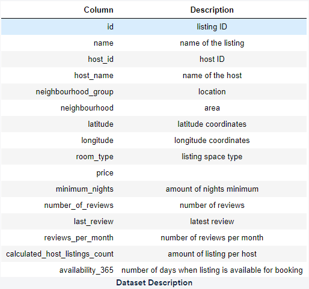

# Storytelling-Case-Study-Airbnb
 Visualise data related to Airbnbs in New York and present insights to various stakeholders.
 
 ## Objective
- To Provide insight into the current market situation.
- Enhance our understanding of property and host acquisitions, 
operations, and customer preferences.
- Provide early recommendations to our marketing and operations 
teams

prepare for the next best steps that Airbnb needs to take as a business, you have been asked to analyse a dataset consisting of various Airbnb listings in New York. Based on this analysis, give two presentations to the following groups.

## Presentation - I
- Data Analysis Managers: These people manage the data analysts directly for processes and their technical expertise is basic.
- Lead Data Analyst: The lead data analyst looks after the entire team of data and business analysts and is technically sound.
## Presentation - II
- Head of Acquisitions and Operations, NYC: This head looks after all the property and host acquisitions and operations. Acquisition of the best properties, price negotiation, and negotiating the services the properties offer falls under the purview of this role.
- Head of User Experience, NYC: The head of user experience looks after the customer preferences and also handles the properties listed on the website and the Airbnb app. Basically, the head of user experience tries to optimise the order of property listing in certain neighbourhoods and cities in order to get every property the optimal amount of traction.

## Data
This dataset contains information about different Airbnb listings along with their hosts, locations, prices and other attributes.
<kbd>    </kbd>

